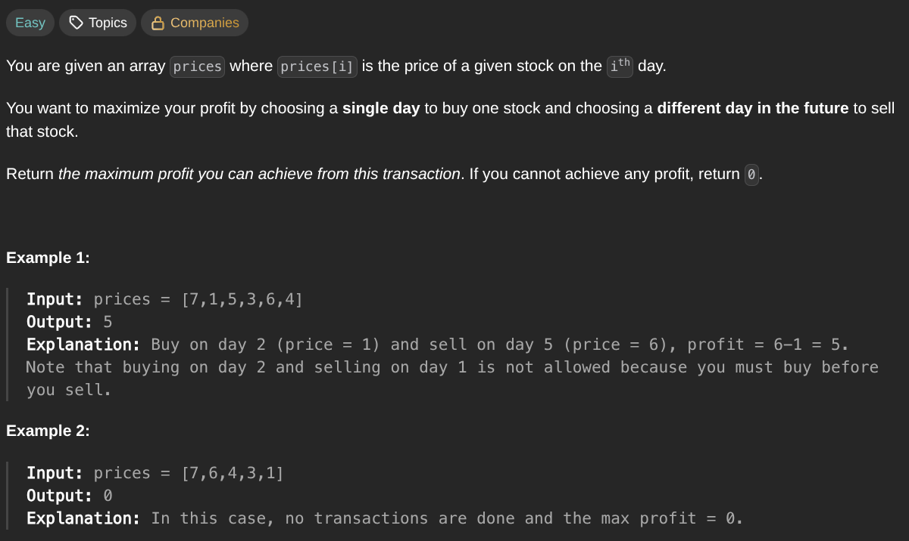

## [Best Time to Buy and Sell Stock](https://leetcode.com/problems/best-time-to-buy-and-sell-stock/description/)
### Description:

### Solution:
```Go
func maxProfit(prices []int) int {
	minPrice, maxProfit := math.MaxInt32, 0
	
	for _, price := range prices {
		minPrice = min(minPrice, price)
		maxProfit = max(maxProfit, price - minPrice)
	}
	
	return maxProfit
}
```
### Time complexity: 
$$ O(n) $$
### Space complexity:
$$ O(1) $$

---
