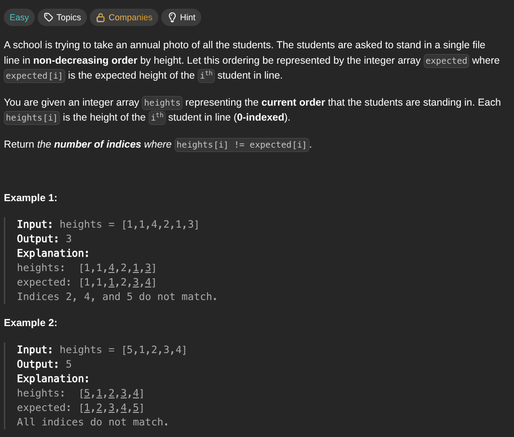

## [Height Checker](https://leetcode.com/problems/height-checker/description/)
### Description:

### Solution:
```Go
func heightChecker(heights []int) int {
	seen := make([]int, 101)
	
	for _, height := range heights {
		seen[height]++
	}
	
	index, result := 0, 0
	
	for i := 1; i <= 100; i++ {
		for j := seen[i]; j > 0; j-- {
			if heights[index] != i {
				result++
			}
			index++
		}
	}
	
	return result
}
```
### Time complexity: 
$$ O(n) $$
### Space complexity:
$$ O(1) $$

---
