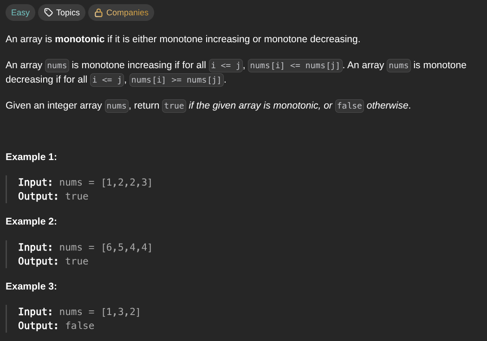

## [Monotonic Array](https://leetcode.com/problems/monotonic-array/description/)
### Description:

### Solution:
```Go
func isMonotonic(nums []int) bool {
	var up, down int
	
	for i := 1; i < len(nums); i++ {
		if nums[i-1] <= nums[i] {
			up++
		}
		if nums[i-1] >= nums[i] {
			down++
		}
	}
	
	countPairs := len(nums) - 1
	return countPairs == up || countPairs == down
}
```
### Time complexity: 
$$ O(n) $$
### Space complexity:
$$ O(1) $$

---
