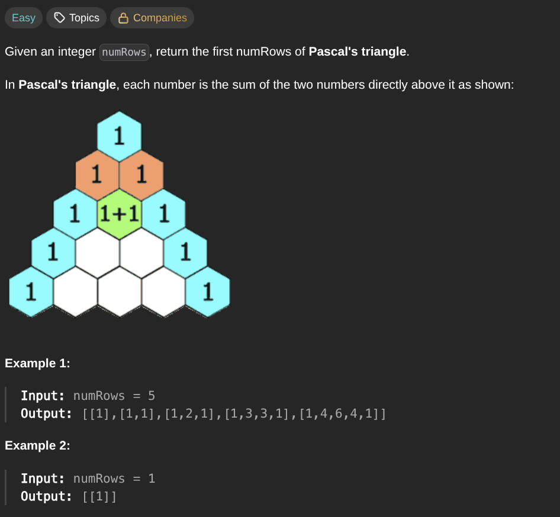

## [Pascal's Triangle](https://leetcode.com/problems/pascals-triangle/description/)
### Description:

### Solution:
```Go
func generate(numsRow int) [][]int {
	if numsRow == 1 { return [][]int{{1}} }
	
	result := generate(numsRow - 1)
	lastRow := result[len(result) - 1]
	newRow := []int{1}
	
	for i := 1; i < len(lastRow); i++ {
		newRow = append(newRow, lastRow[i - 1] + lastRow[i])
	}
	
	newRow = append(newRow, 1)
	result = append(result, newRow)
	return result
}
```
### Time complexity: 
$$ O(n^2) $$
### Space complexity:
$$ O(n^2) $$

---
