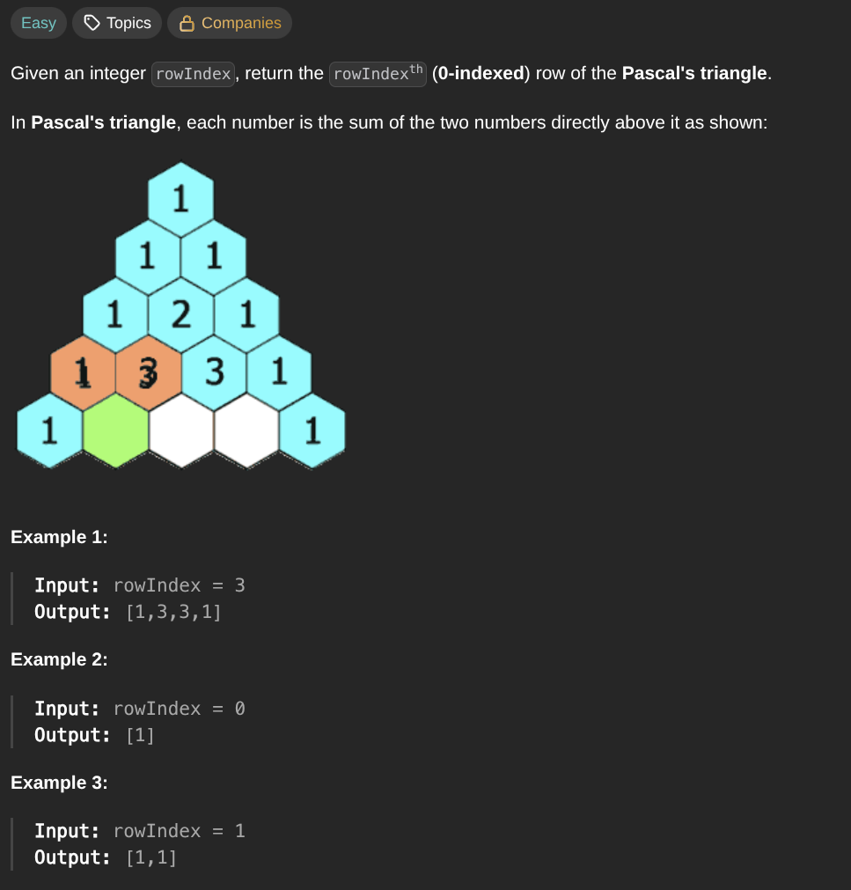

## [Pascal's Triangle II](https://leetcode.com/problems/pascals-triangle-ii/description/)
### Description:

### Solution:
```Go
func getRow(rowIndex int) []int {
	result := []int{1}
	previous := 1
	
	for i := 1; i <= rowIndex; i++ {
		next := previous * (rowIndex - i + 1) / i
		result = append(result, next)
		previous = next
	}
	
	return result
}
```
### Time complexity: 
$$ O(n) $$
### Space complexity:
$$ O(n) $$

---