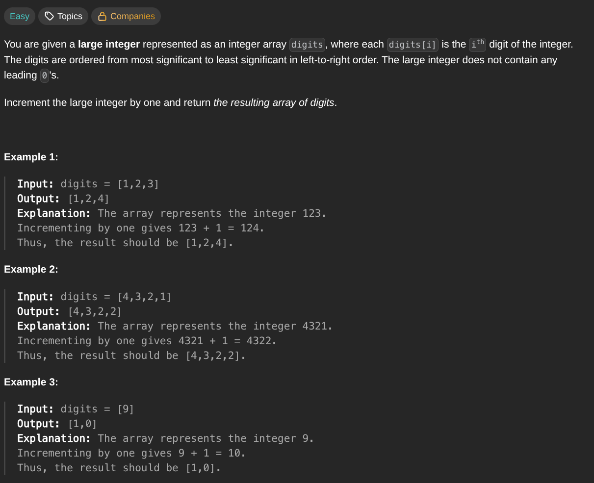

## [Plus One](https://leetcode.com/problems/plus-one/description/)
### Description:

### Solution:
```Go
func plusOne(digits []int) []int {
	for i := len(digits)-1; i >= 0; i-- {
		if digits[i] < 9 {
			digits[i]++
			return digits
		}
		digits[i] = 0
	}
	return append([]int{1}, digits...)
}
```
### Time complexity: 
$$ O(n) $$
### Space complexity:
$$ O(1) $$

---
