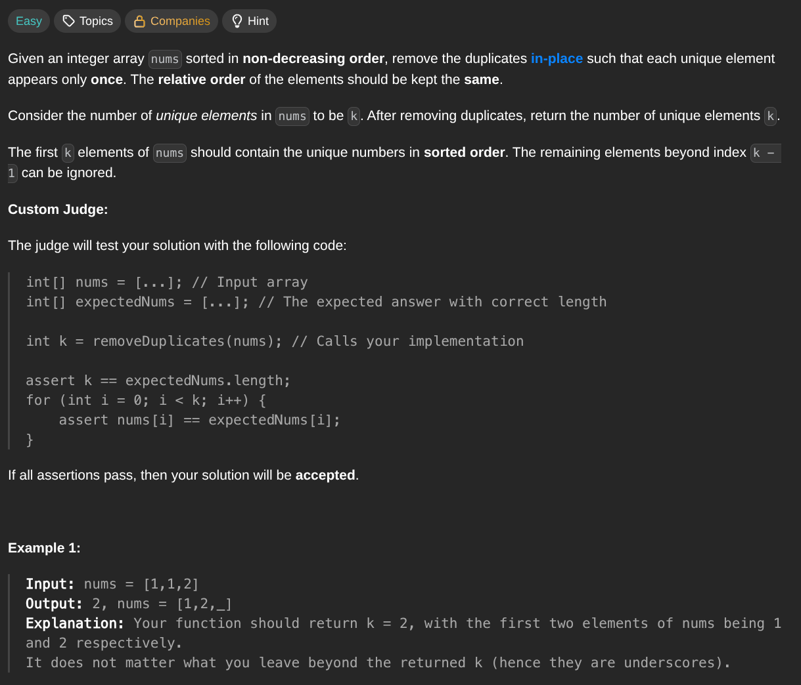

## [Remove Duplicates from Sorted Array](https://leetcode.com/problems/remove-duplicates-from-sorted-array/description/)
### Description:

### Solution:
```Go
func removeDuplicates(nums []int) int {
	index := 1
	for i := 1; i < len(nums); i++ {
		if nums[i] != nums[i-1] {
			nums[index] = nums[i]
			index++
		}
	}

	return index
}
```
### Time complexity: 
$$ O(n) $$
### Space complexity:
$$ O(1) $$

---
