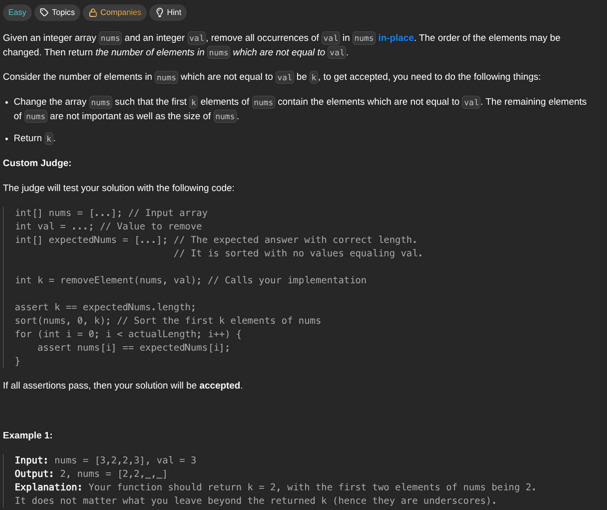

## [Remove Element](https://leetcode.com/problems/remove-element/description/)
### Description:

### Solution:
```Go
func removeElement(nums []int, val int) int {
	index := 0
	
	for i := 0; i < len(nums); i++ {
		if nums[i] != val {
			nums[index] = nums[i]
			index++
		}
	}
	
	return index
}
```
### Time complexity: 
$$ O(n) $$
### Space complexity:
$$ O(1) $$

---
