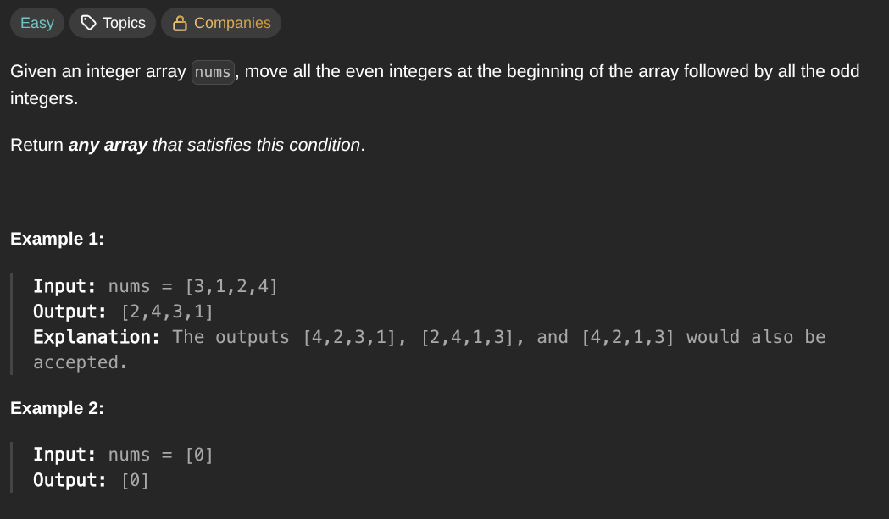

## [Sort Array By Parity](https://leetcode.com/problems/sort-array-by-parity/description/)
### Description:

### Solution:
```Go
func sortArrayByParity(nums []int) []int {
	i, j := 0, len(nums)-1
	
	for i < j {
		for i < j && nums[i] % 2 == 0 {
			i++
		}
		for i < j && nums[j] % 2 == 1 {
			j--
		}
		
		nums[i], nums[j] = nums[j], nums[i]
	}
	
	return nums
}
```
### Time complexity: 
$$ O(n) $$
### Space complexity:
$$ O(1) $$

---
