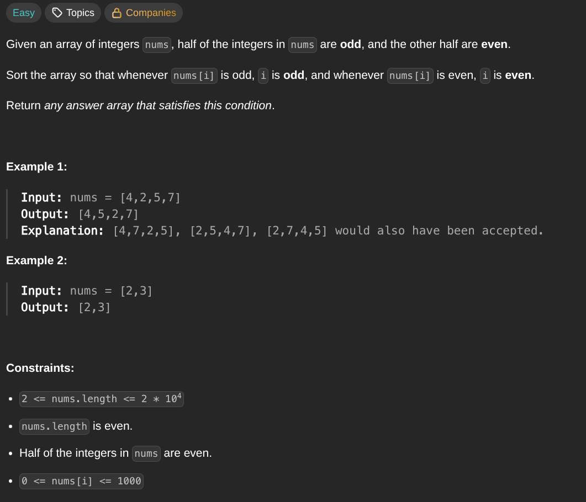

## [Sort Array By Parity II](https://leetcode.com/problems/sort-array-by-parity-ii/description/)
### Description:

### Solution:
```Go
func sortArrayByParityII(nums []int) []int {
	even, odd := 0, 1
	
	for even < len(nums) && odd < len(nums) {
		if nums[even] % 2 != 0 {
			nums[even], nums[odd] = nums[odd], nums[even]
			odd += 2
		} else {
			even += 2
		}
	}
	
	return nums
}
```
### Time complexity: 
$$ O(n) $$
### Space complexity:
$$ O(1) $$

---
