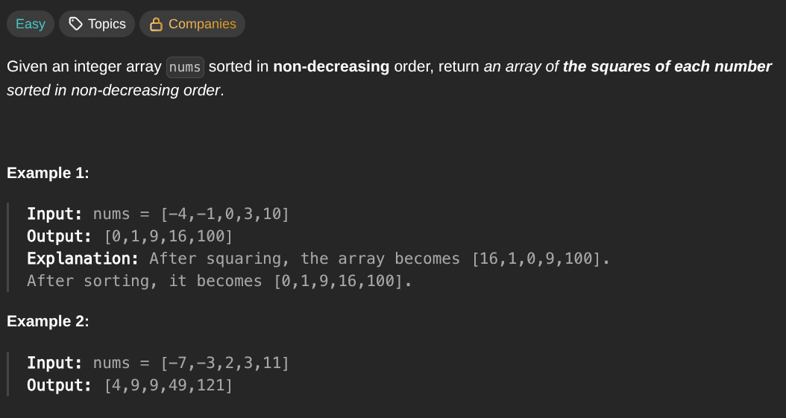

## [Squares of a Sorted Array](https://leetcode.com/problems/squares-of-a-sorted-array/description/)
### Description:

### Solution:
```Go
func abs(x int) int {
	if x < 0 { return -x }
	return x
}

func sortedSquares(nums []int) []int {
	result := make([]int, len(nums))
	left, right := 0, len(nums) - 1
	
	for i := len(nums) - 1; i >= 0; i-- {
		if abs(nums[left]) > abs(nums[right]) {
			result[i] = nums[left] * nums[left]
			left++
		} else {
			result[i] = nums[right] * nums[right] 
			right--
		}
	}
	
	return result
}
```
### Time complexity: 
$$ O(n) $$
### Space complexity:
$$ O(n) $$

---
