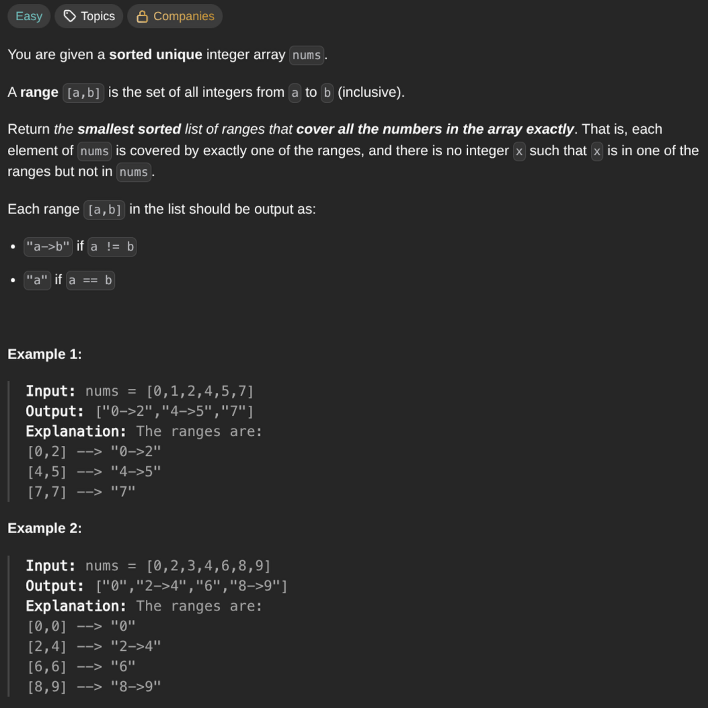

## [Summary Ranges](https://leetcode.com/problems/summary-ranges/description/)
### Description:

### Solution:
```Go
func summaryRanges(nums []int) []string {
	if len(nums) == 0 { return nil }
	
	head := 0
	result := []string{}
	
	for i := range nums {
		if i != len(nums)+1 && nums[i]+1 == nums[i+1] {
			continue
		}
		if head == i {
			result = append(result, strconv.Itoa(nums[i]))
		} else {
			template := strconv.Itoa(nums[head]) + "->" + strconv.Itoa(nums[i])
			result = append(result, template)
		}
		head = i + 1
	}
	
	return result
}
```
### Time complexity: 
$$ O(n) $$
### Space complexity:
$$ O(n) $$

---
